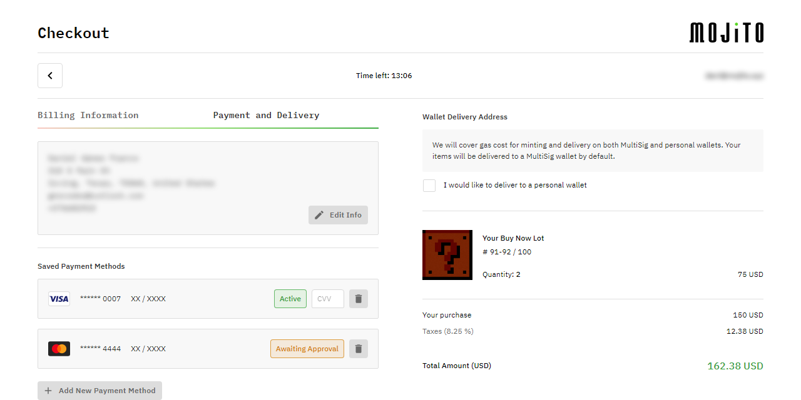

<h1 align="center">Mojito Payment UI</h1>


<br /><br />

<p align="center">
  👨‍💻 Payment UI modal & playground UI to easily test it.
</p><p align="center">
  🚀 Check it out at <a href="https://payments-staging.mojito.xyz/" target="_blank">https://payments-staging.mojito.xyz/</a>!
</p><p align="center">
  ⚠️ This is still in alpha, use with caution.
</p>

<br />


<p align="center">
  <a href="https://payments-staging.mojito.xyz/" target="_blank">
    
  </a>
</p>

<br />


## Working on the project

### Next.js development playground:

While this project will be installed as a dependency in other apps, it also provides a development/test playground to speed up development and improve DX. In order to use it:

1. First, duplicate [`app/.env`](./app/.env) to [`app/.env.local`](./app/.env.local) and add the two missing values.

2. To start the Next.js development playground:

    ```bash
    yarn --cwd app install
    yarn dev
    ```

    This will install the dependencies defined in [`app/package.json`](./app/package.json) and run the Next.js app inside `./app`.
    
3. Access the project at [http://localhost:3000](http://localhost:3000).

4.  Before committing, be sure to run:

    ```bash
    yarn lint
    ```

    There is also `yarn lint:fix` which can automatically fix some lint issues.

    Do not run `yarn deprecated:prettier`, that will be either updated or removed from the project later.

<br />


### Test data and environments:

When testing the purchase flow, you need to make sure to:

- Use a real `orgID` and `lotID` that exists in your Mojito account.

  This can either be a Buy Now lot ot an Auction lot that the test user that you are going to use to make the purchase won.

  You can find them using:

    - **Mojito Manager** - [Dashboard (`orgID`)](https://app.mojito.xyz/dashboard), [Collections (`lotID`)](https://app.mojito.xyz/<path-to-collection>)

    - **Mojito API** - [GraphQL Playground](https://api.dev.mojito.xyz/query)

    - **Contentful API** - [GraphQL Playground](https://graphql.contentful.com/content/v1/spaces/fu9did2d8yaw/environments/staging/explore?access_token=19vUSnF3_8S-OsepxXBcDAI_Ua3GbwSy5c7HNTXB-R0)

- When paying with credit card, use [Circle's](https://developers.circle.com/docs/introducing-circle-apis) [Test card numbers](https://developers.circle.com/docs/test-card-numbers)

- When paying with ACH, refer to [Plaid's](https://plaid.com/docs/) - [Testing OAuth documentation](https://plaid.com/docs/link/oauth/#testing-oauth).

<br />


## Building this project as a library

The project includes a separated Rollup build to build it as a library that can be installed and consumed by other projects.

To build the lib:

```bash
yarn install
yarn dist:build
```

This builds the library using the Rollup setup at the root of the project and the dependencies defined in [`package.json`](./package.json). It does so by temporarily `mv app/src/lib src`, and undoing that once the lib has been built.

<br />


## GraphQL Codegen

Automatically generated types and hooks from the Mojito GraphQL API:

- [`app/src/services/graphql/generated.tsx`](./app/src/services/graphql/generated.tsx)
- [`app/src/lib/queries/graphqlGenerated.tsx`](./app/src/lib/queries/graphqlGenerated.tsx)

To update these, first ensure that you're running a local instance of
`mojito-api` (or change `codegen.yml`'s `schema` property to point to the production API) and then run:

```bash
yarn codegen
```

To create new queries or mutations, create a `.graphql` file (for example [`app/src/lib/queries/me.graphql`](./app/src/lib/queries/me.graphql)) and then run
`yarn codegen` again, and it will automatically find all `.graphql` files in the repo and create typed React hooks from
them. If, for example, the query is called `Organization`, then the auto-generated hook will be called `useOrganizationQuery`.

<br />


## Using this project as a library

Once you've built the library using `yarn dist:build`, you can install it in another project with one of these options
(until it's published in NPM):

    "@mojitoinc/mojito-mixers": "file:../mojito-mixers"
    "@mojitoinc/mojito-mixers": "git+ssh://git@github.com/mojitoinc/mojito-mixers"

<br />


## Usage:

```TSX

import React, { ErrorInfo } from "react";

import {
  PUICheckout,
  PUICheckoutProps,
  useOpenCloseCheckoutModal,
} from "@mojitoinc/mojito-mixers";

const App: React.FC = () => {
  const router = useRouter();
  const { profile } = useProfile();
  const { loginWithPopup, isAuthenticated, isLoading, getIdTokenClaims } = useAuth0();
  const { isOpen, onOpen, onClose } = useOpenCloseCheckoutModal();

  const handleGoToCollection = useCallback(() => {
    router.push("/profile/collection");
  }, []);

  const handleLogin = useCallback(async () => {
    await loginWithPopup({ prompt: "login" });
    await getIdTokenClaims();
  }, [loginWithPopup, getIdTokenClaims]);

  const handleError = useCallback((error: CheckoutModalError) => {
    Sentry.captureException(error);
  }, []);

  const handleEvent = useCallback((eventType: CheckoutEventType, eventData: Partial<CheckoutEventData>) => {
    // Handle the data for each step as you need 
  },)

  const handleCatch = useCallback((error: Error, errorInfo?: ErrorInfo) => {
    Sentry.captureException({ error, errorInfo });
  }, []);

  const handleMarketingOptInChange = useCallback((marketingOptIn: boolean) => {
    // Subscribe / unsubscribe
  }, []);

  useEffect(() => {
    // Open the modal automatically:
    onOpen();
  }, [onOpen])
  
  const checkoutModalProps: PUICheckoutProps = {
    // ProviderInjector:
    uri: config.MOJITO_API_URL,

    // Modal:
    open: isOpen,
    onClose,

    // Flow:
    guestCheckoutEnabled: false,
    productConfirmationEnabled: false,

    // Personalization:
    // These two options, `theme` (replace default theme) and `themeOptions` (merge with default theme) are optional and 
    // can't be defined at the same time:
    // theme: YOUR_CUSTOM_THEME,
    themeOptions: YOUR_CUSTOM_THEME_OPTIONS,
    logoSrc: "https://...",
    logoSx: { ... },
    loaderImageSrc: "https://...",
    purchasingImageSrc: "https://...",
    purchasingMessages: ["...", "...", "..."],
    errorImageSrc: "https://...",
    userFormat: "email",
    acceptedPaymentTypes: ["CreditCard", "ACH"],
    dictionary: {
      walletInfo: <p>Lorem ipsum...</p>,
    },

    // Legal:
    consentType: "circle",
    privacyHref: "https://...",
    termsOfUseHref: "https://...",

    // Data:
    orgID: "<ORG_ID>", // Usually profile.userOrgs[0].organizationId
    invoiceID: "<INVOICE_ID>" // Only required for auction lots"
    checkoutItem: {
      lotID: "<LOT_IT>",
      buyNow: "buyNow",
      name: "Lorem ipsum...",
      description: "Lorem ipsum...",
      price: 0,
      fee: 0,
      imageSrc: "https://...",
      imageBackground: "rgba(...)",
    },
    
    // Authentication:
    onLogin: handleLogin,
    isAuthenticated,
    isAuthenticatedLoading: isLoading,

    // Steps Events:
    onEvent: handleEvent,

    // Other Events:
    debug: true,
    onError: handleError,
    onCatch: handleCatch,
    onMarketingOptInChange: handleMarketingOptInChange,
  };

  return <PUICheckout { ...checkoutModalProps } />;
};
```

<br />


### Credit Card payments with 3DS

Additionally, when using 3DS for Credit Card payments you need to add a `/e/success/` and a `/e/error/` (TODO: review this) page with the
following logic to be able to resume 3DS's flow when users are redirected back to your app:

```TSX

// /e/success/:

const CreditCardPaymentSuccessPage: React.FC = () => {
  const router = useRouter();

  const handleRedirect = useCallback((pathnameOrUrl: string) => {
    if (pathnameOrUrl && pathnameOrUrl.startsWith("http")) {
      window.location.replace(pathnameOrUrl);
    } else {
      router.replace(pathnameOrUrl || "/");
    }
  }, [router]);

  return (
    <PUISuccess
      themeOptions={ YOUR_CUSTOM_THEME_OPTIONS }
      logoSrc="https://..."
      logoSx={ ... }
      successImageSrc="https://..."
      onRedirect={ handleRedirect } />
  );
};

export default CreditCardPaymentSuccessPage;
```

```TSX

// /e/error/:

const CreditCardPaymentErrorPage: React.FC = () => {
  const router = useRouter();

  const handleRedirect = useCallback((pathnameOrUrl: string) => {
    if (pathnameOrUrl && pathnameOrUrl.startsWith("http")) {
      window.location.replace(pathnameOrUrl);
    } else {
      router.replace(pathnameOrUrl || "/");
    }
  }, [router]);

  return (
    <PUIError
      themeOptions={ YOUR_CUSTOM_THEME_OPTIONS }
      logoSrc="https://..."
      logoSx={ ... }
      errorImageSrc="https://..."
      onRedirect={ handleRedirect } />
  );
};

export default CreditCardPaymentErrorPage;
```

<br />


### ACH payments with Plaid: 

Additionally, when using Plaid for ACH payments you need to add an `/oauth` page with the following logic to be able
to resume Plaid's OAuth flow when users are redirected back to your app:

```TSX

const PlaidOAuthPage = () => {
  const router = useRouter();

  const { continueOAuthFlow, url } = getPlaidOAuthFlowState();

  useLayoutEffect(() => {
    if (continueOAuthFlow) {
      persistPlaidReceivedRedirectUri(window.location.href);
    }

    router.replace(url || "/");
  }, [continueOAuthFlow, router, url]);

  return null;
};

export default PlaidOAuthPage;
```

<br />


### Theming 

You can use the `themeOptions` or `theme` props to pass a custom theme or theme options object:

- `themeOptions` (preferred) will merge Mojito's default theme with your custom one.

  ```TSX
  <PUICheckout themeOptions={ YOUR_CUSTOM_THEME_OPTIONS } { ...checkoutModalProps } />
  ```

  See [`extendDefaultTheme(...)`](app/src/lib/config/theme/theme.ts).

- `theme` will completely replace Mojito's default theme with the one you provide.

  ```TSX
  <PUICheckout theme={ YOUR_CUSTOM_THEME } { ...checkoutModalProps } />
  ```

  See 
[`ProvidersInjector`](app/src/lib/components/shared/ProvidersInjector/ProvidersInjector.tsx).

- If none is provided, the [default Mojito theme](app/src/lib/config/theme) will be used.

<br />


Note that using MUI's `ThemeProvider` from your project won't work as expected and you will end up seeing Mojito's default theme:

```TSX
<ThemeProvider theme={ YOUR_CUSTOM_THEME }>
  <PUICheckout { ...checkoutModalProps } />
</ThemeProvider>
```

<br />


### Dictionary

There are some texts inside the Payment UI that you can customize using `PUICheckout`'s `dictionary` prop (more to come, ideally all texts should be customizable). You can find them all with their respective default values here:

[`app/src/lib/domain/dictionary/dictionary.constants.tsx`](./app/src/lib/domain/dictionary/dictionary.constants.tsx).

<br />


## TypeScript Support

You will have to copy the following file into your project to avoid TypeScript errors when using custom props in MUI's theme:

[`app/src/lib/domain/mui/mui.d.ts`](./app/src/lib/domain/mui/mui.d.ts).

<br />


## Error Handling

All components exported by this library are wrapped in a custom [`ErrorBoundary`](https://reactjs.org/docs/error-boundaries.html) so that, in the event of an unexpected error in the library, it doesn't crash your app as well. You can find it here:

[`app/src/lib/components/public/ErrorBoundary/ErrorBoundary.tsx`](./app/src/lib/components/public/ErrorBoundary/ErrorBoundary.tsx).

By default, if an unexpected error occurs, a confirm window/modal will be presented to the users asking them if they want to re-open the Payment UI:


<br/>
<p align="center">
  <a href="https://github.com/mojitoinc/mojito-mixers/blob/main/screenshots/error-boundary-confirm.png">
    
  </a>
</p>
<br/>


If you don't want this behavior or would like to implement a custom one, you should pass a value for `onCatch: (error: Error, errorInfo?: ErrorInfo) => void | true;` prop with a callback. If you want to get notified about unexpected errors but would still like to preserve the default behavior, return `true` from your callback.

<br />


## Images

The following images are loaded directly from GitHub to avoid bundling them with the library or forcing users to include them in their repos and add the necessary build setup to load them. They should just work out of the box, no setup required:

- `PurchasingView`'s default loader image.
- `ErrorView`'s default error image.
- `PaymentView`'s Circle logo image.

<br/>


**`PurchaseView`'s default loader image:**

<br/>
<p align="center">
  <a href="https://github.com/mojitoinc/mojito-mixers/blob/main/app/src/lib/assets/mojito-loader.gif">
    
  </a>
</p>
<br/>


    > Repo: https://github.com/mojitoinc/mojito-mixers/blob/main/app/src/lib/assets/mojito-loader.gif (add `?raw=true` to get the CDN URL below)

    > CDN URL: https://raw.githubusercontent.com/mojitoinc/mojito-mixers/main/app/src/lib/assets/mojito-loader.gif

<br/>


**`ErrorView`'s default error image:**

<br/>
<p align="center">
  <a href="https://github.com/mojitoinc/mojito-mixers/blob/main/app/src/lib/assets/mojito-error-loader.gif">
    
  </a>
</p>
<br/>


    > Repo: https://github.com/mojitoinc/mojito-mixers/blob/main/app/src/lib/assets/mojito-error-loader.gif (add `?raw=true` to get the CDN URL below)

    > CDN URL: https://raw.githubusercontent.com/mojitoinc/mojito-mixers/main/app/src/lib/assets/mojito-error-loader.gif

<br/>


Alternative static version:

<br/>
<p align="center">
  <a href="https://github.com/mojitoinc/mojito-mixers/blob/main/app/src/lib/assets/mojito-error-loader-static.png">
    
  </a>
</p>
<br/>


    > Repo: https://github.com/mojitoinc/mojito-mixers/blob/main/app/src/lib/assets/mojito-error-loader-static.png (add `?raw=true` to get the CDN URL below)

    > CDN URL: https://raw.githubusercontent.com/mojitoinc/mojito-mixers/main/app/src/lib/assets/mojito-error-loader-static.png

<br/>


**`PaymentView`'s Circle logo image:**

<br/>
<p align="center">
  <a href="https://raw.githubusercontent.com/mojitoinc/mojito-mixers/main/app/src/lib/assets/circle.png">
    
  </a>
</p>
<br/>


    > Repo: https://github.com/mojitoinc/mojito-mixers/blob/main/app/src/lib/assets/circle.png (add `?raw=true` to get the CDN URL below)

    > CDN URL: https://raw.githubusercontent.com/mojitoinc/mojito-mixers/main/app/src/lib/assets/circle.png

