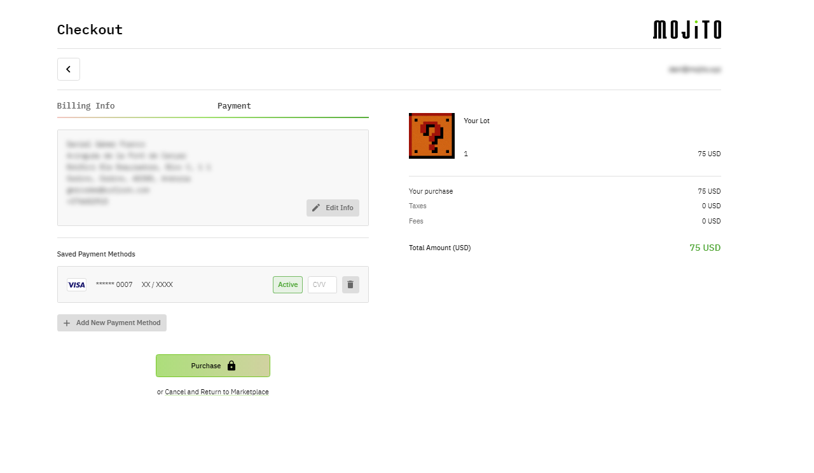

<h1 align="center">Mojito Payment UI</h1>


<br /><br />

<p align="center">
  👨‍💻 Mojito Payment UI modal & playground UI to easily test payments with credit card, ACH, Wire and Crypto payments with Circle, 3DS, Plaid and Vertex integrations.
</p><p align="center">
  🚀 Check it out at <a href="https://payments-staging.mojito.xyz/" target="_blank">https://payments-staging.mojito.xyz/</a>!
</p><p align="center">
  ⚠️ This is still in alpha, use with caution.
</p>

<br />


<p align="center">
  <a href="https://payments-staging.mojito.xyz/" target="_blank">
    
  </a>
</p>

<br />


## Working on the project

### Next.js development playground:

While this project will be installed as a dependency in other apps, it also provides a development/test playground to speed up development and improve DX. In order to use it:

1. First, duplicate [`app/.env`](./app/.env) to [`app/.env.local`](./app/.env.local) and add the two missing values.

2. To start the Next.js development playground:

    ```bash
    yarn --cwd app install
    yarn dev
    ```

    This will install the dependencies defined in [`app/package.json`](./app/package.json) and run the Next.js app inside `./app`.
    
3. Access the project at [http://localhost:3000](http://localhost:3000).

4.  Before committing, be sure to run:

    ```bash
    yarn lint
    ```

    There is also `yarn lint:fix` which can automatically fix some lint issues.

    Do not run `yarn deprecated:prettier`, that will be either updated or removed from the project later.

<br />


### Test data and environments:

When testing the purchase flow, you need to make sure to:

- Use a real `orgID` and `lotID` that exists in your Mojito account.

  This can either be a Buy Now lot ot an Auction lot that the test user that you are going to use to make the purchase won.

  You can find them using:

    - **Mojito Mint** - [`https://mint.dev.mojito.xyz/`](https://mint.dev.mojito.xyz/).

    - **Mojito API GraphQL Playground** - [`https://api.dev.mojito.xyz/query`](https://api.dev.mojito.xyz/query)

- When paying with credit card, use [Circle's](https://developers.circle.com/docs/introducing-circle-apis) [Test card numbers](https://developers.circle.com/docs/test-card-numbers). As you can see, only Visa and MasterCard are supported.

- If you want to verify the validation of other credit card networks or the functionality of the `PaymentMethodForm` in general, you can use these [test card numbers](https://www.paypalobjects.com/en_GB/vhelp/paypalmanager_help/credit_card_numbers.htm).

- If you want to check 3DS' error handling, see [3DS in Sandbox](https://developers.circle.com/docs/3d-secure-authentication#3d-secure-in-sandbox) on how to force those errors to be triggered in the sandbox environment.

- When paying with ACH, refer to [Plaid's](https://plaid.com/docs/) - [Testing OAuth documentation](https://plaid.com/docs/link/oauth/#testing-oauth).

<br />


## Building this project as a library

The project includes a separated Rollup build to build it as a library that can be installed and consumed by other projects.

To build the lib:

```bash
yarn install
yarn dist:build
```

This builds the library using the Rollup setup at the root of the project and the dependencies defined in [`package.json`](./package.json). It does so by temporarily `mv app/src/lib src`, and undoing that once the lib has been built.

<br />


## GraphQL Codegen

Automatically generated types and hooks from the Mojito GraphQL API:

- [`app/src/services/graphql/generated.tsx`](./app/src/services/graphql/generated.tsx)
- [`app/src/lib/queries/graphqlGenerated.tsx`](./app/src/lib/queries/graphqlGenerated.tsx)

To update these, first ensure that you're running a local instance of
`mojito-api` (or change `codegen.yml`'s `schema` property to point to the production API) and then run:

```bash
yarn codegen
```

To create new queries or mutations, create a `.graphql` file (for example [`app/src/lib/queries/me.graphql`](./app/src/lib/queries/me.graphql)) and then run
`yarn codegen` again, and it will automatically find all `.graphql` files in the repo and create typed React hooks from
them. If, for example, the query is called `Organization`, then the auto-generated hook will be called `useOrganizationQuery`.

<br />


## Using this project as a library

Once you've built the library using `yarn dist:build`, you can install it in another project with one of these options
(until it's published in NPM):

    "@mojitoinc/mojito-mixers": "file:../mojito-mixers"
    "@mojitoinc/mojito-mixers": "git+ssh://git@github.com/mojitoinc/mojito-mixers"

Also, make sure you install the following dependencies:

    react
    react-dom
    @mui/material

And also, keep in mind:

- `@emotion/react` is not needed.

- `@emotion/styled` is needed as stated in [MUI's docs](https://mui.com/guides/interoperability/):

    > Keep `@emotion/styled` as a dependency of your project. Even if you never use it explicitly, it's a peer dependency of `@mui/material`.

- `styled-components` is needed as stated in [`react-payment-inputs`' docs](https://github.com/medipass/react-payment-inputs#using-the-built-in-styled-wrapper), but it's not used:

    > Note: <PaymentInputsWrapper> requires styled-components to be installed as a dependency.
    >
    > By default, React Payment Inputs does not have built-in styling for it's inputs. However, React Payment Inputs comes with a styled wrapper which combines the card number, expiry & CVC fields...

<br />


## Usage:

```TSX

import React, { ErrorInfo } from "react";

import {
  PUICheckout,
  PUICheckoutProps,
  useOpenCloseCheckoutModal,
} from "@mojitoinc/mojito-mixers";

const App: React.FC = () => {
  const router = useRouter();
  const { profile } = useProfile();
  const { loginWithPopup, isAuthenticated, isLoading, getIdTokenClaims } = useAuth0();
  const { isOpen, onOpen, onClose } = useOpenCloseCheckoutModal();

  const handleGoToCollection = useCallback(() => {
    router.push("/profile/collection");
  }, []);

  const handleLogin = useCallback(async () => {
    await loginWithPopup({ prompt: "login" });
    await getIdTokenClaims();
  }, [loginWithPopup, getIdTokenClaims]);

  const handleError = useCallback((error: CheckoutModalError) => {
    Sentry.captureException(error);
  }, []);

  const handleEvent = useCallback((eventType: CheckoutEventType, eventData: CheckoutEventData) => {
    // Handle the data for each step or action as needed.
  }, []);

  const handleCatch = useCallback((error: Error, errorInfo?: ErrorInfo) => {
    Sentry.captureException({ error, errorInfo });
  }, []);

  const handleMarketingOptInChange = useCallback((marketingOptIn: boolean) => {
    // Subscribe / unsubscribe.
  }, []);

  useEffect(() => {
    // Open the modal automatically:
    onOpen();
  }, [onOpen])
  
  const checkoutModalProps: PUICheckoutProps = {
    // ProviderInjector:
    uri: config.MOJITO_API_URL,

    // Modal:
    open: isOpen,
    onClose,

    // Flow:
    guestCheckoutEnabled: false,
    productConfirmationEnabled: false,
    vertexEnabled: true, // Default already true (requires set up on the backend).
    threeDSEnabled: true, // Default already true (requires set up on the backend and frontend, see 3DS section below).

    // Personalization:
    // These two options, `theme` (replace default theme) and `themeOptions` (merge with default theme) are optional and 
    // can't be defined at the same time:
    // theme: YOUR_CUSTOM_THEME,
    themeOptions: YOUR_CUSTOM_THEME_OPTIONS,
    logoSrc: "https://...",
    logoSx: { ... },
    loaderImageSrc: "https://...",
    purchasingImageSrc: "https://...",
    purchasingMessages: ["...", "...", "..."],
    errorImageSrc: "https://...",
    userFormat: "email",
    acceptedPaymentTypes: ["CreditCard", "ACH"],
    dictionary: {
      walletInfo: <p>Lorem ipsum...</p>,
    },

    // Legal:
    consentType: "circle",
    privacyHref: "https://...",
    termsOfUseHref: "https://...",

    // Data:
    orgID: "<ORG_ID>", // Usually profile.userOrgs[0].organizationId
    invoiceID: "<INVOICE_ID>" // Only required for auction lots"
    checkoutItem: {
      lotID: "<LOT_IT>",
      buyNow: "buyNow",
      name: "Lorem ipsum...",
      description: "Lorem ipsum...",
      price: 0,
      fee: 0,
      imageSrc: "https://...",
      imageBackground: "rgba(...)",
    },
    
    // Authentication:
    onLogin: handleLogin,
    isAuthenticated,
    isAuthenticatedLoading: isLoading,

    // Other Events:
    debug: true,
    onEvent: handleEvent,
    onError: handleError,
    onCatch: handleCatch,
    onMarketingOptInChange: handleMarketingOptInChange,
  };

  return <PUICheckout { ...checkoutModalProps } />;
};
```

<br />


### Address Validation & Tax Calculation with Vertex

Id you'd like address to be validated and taxes to be calculated during the checkout process, particularly in the Billing
Information step, you need a Vertex account.

Alternatively, set the following prop to disable those calls to the backend: `vertexEnabled = false`.

<br />


### Credit Card payments with 3DS

Additionally, when using 3DS for Credit Card payments you need to add a success and error page into your app. The URL can
be anything you want as long as you configure that in your 3DS account. In this repo, those pages are:

- `/payments/success` => [app/src/pages/payments/success.tsx](./app/src/pages/payments/success.tsx).
- `/payments/error` => [app/src/pages/payments/error.tsx](./app/src/pages/payments/error.tsx).

Alternatively, `/payments/failure` is also valid.

You can just copy-paste those into your project as a starting point, only minor changes are needed there. As you can see,
most of the logic in those pages is already provided by this library in the
[`PUISuccess`](./app/src/lib/components/public/SuccessOverlay/SuccessOverlay.tsx) and
[`PUIError`](app/src/lib/components/public/ErrorOverlay/ErrorOverlay.tsx) components.

If you don't have a 3DS account and just want to disable that step, you can do that with the following prop: `threeDSEnabled = false`.

```TSX
// /payments/success:

const CreditCardPaymentSuccessPage: React.FC = () => {
  const router = useRouter();

  const handleRedirect = useCallback((pathnameOrUrl: string) => {
    if (pathnameOrUrl && pathnameOrUrl.startsWith("http")) {
      window.location.replace(pathnameOrUrl);
    } else {
      router.replace(pathnameOrUrl || "/");
    }
  }, [router]);

  return (
    <PUISuccess
      themeOptions={ YOUR_CUSTOM_THEME_OPTIONS }
      logoSrc="https://..."
      logoSx={ ... }
      successImageSrc="https://..."
      onRedirect={ handleRedirect } />
  );
};

export default CreditCardPaymentSuccessPage;
```

```TSX

// /payments/error:

const CreditCardPaymentErrorPage: React.FC = () => {
  const router = useRouter();

  const handleRedirect = useCallback((pathnameOrUrl: string) => {
    if (pathnameOrUrl && pathnameOrUrl.startsWith("http")) {
      window.location.replace(pathnameOrUrl);
    } else {
      router.replace(pathnameOrUrl || "/");
    }
  }, [router]);

  return (
    <PUIError
      themeOptions={ YOUR_CUSTOM_THEME_OPTIONS }
      logoSrc="https://..."
      logoSx={ ... }
      errorImageSrc="https://..."
      onRedirect={ handleRedirect } />
  );
};

export default CreditCardPaymentErrorPage;
```

<br />


### ACH payments with Plaid: 

Additionally, when using Plaid for ACH payments you need to add an `/oauth` page with the following logic to be able
to resume Plaid's OAuth flow when users are redirected back to your app:

```TSX

const PlaidOAuthPage = () => {
  const router = useRouter();

  const { continueOAuthFlow, url } = getPlaidOAuthFlowState();

  useLayoutEffect(() => {
    if (continueOAuthFlow) {
      persistPlaidReceivedRedirectUri(window.location.href);
    }

    router.replace(url || "/");
  }, [continueOAuthFlow, router, url]);

  return null;
};

export default PlaidOAuthPage;
```

<br />


### Theming 

You can use the `themeOptions` or `theme` props to pass a custom theme or theme options object:

- `themeOptions` (preferred) will merge Mojito's default theme with your custom one.


  ```TSX
  <PUICheckout themeOptions={ YOUR_CUSTOM_THEME_OPTIONS } { ...checkoutModalProps } />

  ```

  See [`extendDefaultTheme(...)`](app/src/lib/config/theme/theme.ts).

- `theme` will completely replace Mojito's default theme with the one you provide.


  ```TSX
  <PUICheckout theme={ YOUR_CUSTOM_THEME } { ...checkoutModalProps } />

  ```

  See 
[`ProvidersInjector`](app/src/lib/components/shared/ProvidersInjector/ProvidersInjector.tsx).

- If none is provided, the [default Mojito theme](app/src/lib/config/theme) will be used.

<br />


Note that using MUI's `ThemeProvider` from your project won't work as expected and you will end up seeing Mojito's default theme:

```TSX
<ThemeProvider theme={ YOUR_CUSTOM_THEME }>
  <PUICheckout { ...checkoutModalProps } />
</ThemeProvider>
```

<br />


### Dictionary

There are some texts inside the Payment UI that you can customize using `PUICheckout`'s `dictionary` prop (more to come, ideally all texts should be customizable). You can find them all with their respective default values here:

[`app/src/lib/domain/dictionary/dictionary.constants.tsx`](./app/src/lib/domain/dictionary/dictionary.constants.tsx).

<br />


### Errors, Exceptions and Validation Messages

Error, exception and validation messages in the Payment UI are displayed in the [`ErrorView`](./app/src/lib/views/Error/ErrorView.tsx)
and have a configurable button text and action (what the button does or where it takes users when clicking it). Particularly,
those actions are:

- reset: Re-creates the reservation/invoice.
- authentication: Takes users to the authentication view (currently not used).
- billing: Takes users to the billing view/form.
- payment: Takes users to the payment view/form.
- purchasing: Takes users to the purchasing view and re-tries payment.

<br />


**Error messages**

Defined in [`app/src/lib/domain/errors/errors.constants.ts`](./app/src/lib/domain/errors/errors.constants.ts):

- `ERROR_GENERIC = ` An unexpected error happened.

  `action = payment`

- `ERROR_LOADING = ` Loading error details...

  `action = payment`

- `ERROR_LOADING_USER = ` User could not be loaded.

  `action = billing`

- `ERROR_LOADING_PAYMENT_METHODS = ` Payment methods could not be loaded.

  `action = billing`

- `ERROR_LOADING_INVOICE = ` Invoice could not be loaded.

  `action = billing`

- `ERROR_PURCHASE = ` The purchase could not be completed.

  `action = payment`

- `ERROR_PURCHASE_TIMEOUT = ` The purchase could not be completed in time.

  `action = payment`

- `ERROR_PURCHASE_NO_ITEMS = ` No items to purchase.

  `action = payment`

- `ERROR_PURCHASE_NO_UNITS = ` No units to purchase.

  `action = payment`

- `ERROR_PURCHASE_LOADING_ITEMS = ` Purchase items could not be loaded.

  `action = payment`

- `ERROR_PURCHASE_SELECTED_PAYMENT_METHOD = ` Could not find the selected payment method.

  `action = payment`

- `ERROR_PURCHASE_CREATING_PAYMENT_METHOD = ` Payment method could not be saved.

  `action = billing`

- `ERROR_PURCHASE_CREATING_INVOICE = ` Invoice could not be created.

  `action = reset`

- `ERROR_PURCHASE_CVV = ` Could not verify CVV.

  `action = payment`

- `ERROR_PURCHASE_PAYING = ` Payment failed.

  `action = payment`

- `ERROR_PURCHASE_3DS = ` Payment method could not be verified.

  `action = payment`

- `ERROR_INVOICE_TIMEOUT = ` Your product reservation expired. Please, try to complete the purchase again in time.

  `action = reset`

<br />

Additionally, there are some backend errors that are mapped to frontend ones:

- `lot auction not started = ` The auction has not started yet.

  `action = reset`

- `payment limit exceeded = ` You have already bought the maximum number of NFTs allowed for this sale.

  `action = reset`

- `name should contains first and last name = ` Full Name must have at least first and last name.

  `action = billing`

<br />


**Exceptions messages**

Defined in [`app/src/lib/domain/errors/exceptions.constants.ts`](./app/src/lib/domain/errors/exceptions.constants.ts):

- `DEV.THEME_PROVIDER = ` (DEV) You can't use both `themeOptions` and `theme`. Please, use only one. `themeOptions` is preferred.

- `DEV.APOLLO_PROVIDER_DUPLICATE = ` (DEV) You can't use both `apolloClient` and `uri`. Please, use only one. `uri` is preferred.

- `DEV.APOLLO_PROVIDER_MISSING = ` (DEV) You must set `apolloClient` or `uri`. Please, add one. `uri` is preferred.

- `DEV.ENCRYPTION_KEYS_MISSING = ` (DEV) Missing `publicKey` or `keyID`.

- `PAYMENT_METHOD.UNSUPPORTED = ` Unsupported payment method.

- `PAYMENT_METHOD.CREATION_FAILED = ` Payment method could not be created.

- `PAYMENT_METHOD.VALIDATION_FAILED = ` Payment method could not be validated.

- `PAYMENT_METHOD.VALIDATION_TIMEOUT = ` Payment method validation took too long.

<br />


Note those prefixed with `(DEV)` will never be shown to regular users. Instead, they will see the `ERROR_GENERIC` from above.

<br />


**Validation Messages**

Defined in [`app/src/lib/utils/validationUtils.ts`](./app/src/lib/utils/validationUtils.ts):


- `withRequiredErrorMessage = ` `{ label }` is required.

- `withTypeErrorMessageFor = ` `{ label }` must be a `{ type }`.

- `withInvalidErrorMessage = ` `{ label }` is not valid.

- `withFullNameErrorMessage = ` `{ label }` must have at least first and last name.

- `withPhoneErrorMessage = ` `{ label }` must be a valid phone number.

- `withInvalidCardNumber = ` `{ label }` is invalid.

- `withInvalidCVV = ` `{ cvvLabel }` must have `{ cvvExpectedLength }` digits.

- `withInvalidCreditCardNetwork = ` Only `{ acceptedCreditCardNetworks }` `{ is/a`re } accepted.

<br />


### (Secret) Debug Mode

If you quickly click the logo in the top-right corner 16 times, the debug mode will be enabled (toggled, actually), even in production and regardless of
the initial value you passed for the `debug` prop.

The debug mode will, among logging/displaying some other less relevant pieces of data:

<br />


- Show form values and errors as JSON below the form:

  

  

<br />


- Show additional logging information for the most relevant queries/mutation being made:

  

<br />


## TypeScript Support

You will have to add the following file into your project to avoid TypeScript errors when using custom props in MUI's theme:

```TSX
import "@mui/material/styles";
import { PalettePaymentUI } from "@mojitoinc/mojito-mixers";

declare module "@mui/material/styles" {
  interface Palette {
    paymentUI?: PalettePaymentUI;
  }

  interface PaletteOptions {
    paymentUI?: PalettePaymentUI;
  }
}
```

You can see an example here: [`app/src/lib/domain/mui/mui.d.ts`](./app/src/lib/domain/mui/mui.d.ts)

<br />


## Error Handling

All components exported by this library are wrapped in a custom [`ErrorBoundary`](https://reactjs.org/docs/error-boundaries.html) so that, in the event of an unexpected error in the library, it doesn't crash your app as well. You can find it here:

[`app/src/lib/components/public/ErrorBoundary/ErrorBoundary.tsx`](./app/src/lib/components/public/ErrorBoundary/ErrorBoundary.tsx).

By default, if an unexpected error occurs, a confirm window/modal will be presented to the users asking them if they want to re-open the Payment UI:


<br/>
<p align="center">
  <a href="https://github.com/mojitoinc/mojito-mixers/blob/main/screenshots/error-boundary-confirm.png">
    
  </a>
</p>
<br/>


If you don't want this behavior or would like to implement a custom one, you should pass a value for `onCatch: (error: Error, errorInfo?: ErrorInfo) => void | true;` prop with a callback. If you want to get notified about unexpected errors but would still like to preserve the default behavior, return `true` from your callback.

<br />


## `onEvent` callback prop:

The `onEvent` callback prop can be used to get updates about the progress of the user using the Payment UI, which can be useful for analytics:

```TSX
onEvent?: (eventType: CheckoutEventType, eventData: CheckoutEventData) => void;
```

<br />


### `eventType: CheckoutEventType` values:

Events triggered when the user sees a specific view:

- `navigate:authentication`
- `navigate:billing`
- `navigate:payment`
- `navigate:purchasing`
- `navigate:confirmation`
- `navigate:error`

Events triggered when the user performs a specific action:

- `event:paymentSuccess`: The "Purchase" button in the Payment view has been clicked and the payment has been made successfully.
- `event:paymentError`: The "Purchase" button in the Payment view has been clicked and the payment has been attempted, but it failed.

<br />


### `eventData: Partial<CheckoutEventData>` props:

All events will provide this data, but notice some properties are optional, as they might not be available for all steps:

```TSX
interface CheckoutEventData {
  // auth0ID: string; // Not added, already on the parent.
  // checkoutType: string; // Not added, already on the parent.
  // customerId: string; // Not added, already on the parent.

  // Location:
  step: number;
  stepName: string;

  // Purchase:
  departmentCategory: "NFT";
  paymentType?: PaymentType; // "CreditCard" | "ACH" | "Wire" | "Crypto"
  shippingMethod: ShippingMethod; // "custom wallet" | "multisig wallet"
  checkoutItems: CheckoutItem[]; // Provided as this might be a mix of the checkoutItems prop and some additional data from the invoice.

  // Payment:
  currency: "USD";
  revenue: number; // Revenue (subtotal) associated with the transaction, excluding shipping and taxes.
  fees: number;
  tax?: number;
  total: number; // Total value of the order with discounts, taxes and fees.

  // Order:
  circlePaymentID?: string; // Can be used as orderID.
  paymentID?: string; // Can be used as orderID.
}
```

<br />


## Images

The following images are loaded directly from GitHub to avoid bundling them with the library or forcing users to include them in their repos and add the necessary build setup to load them. They should just work out of the box, no setup required:

- `PurchasingView`'s default loader image.
- `ErrorView`'s default error image.
- `PaymentView`'s Circle logo image.

<br/>


**`PurchaseView`'s default loader image:**

<br/>
<p align="center">
  <a href="https://github.com/mojitoinc/mojito-mixers/blob/main/app/src/lib/assets/mojito-loader.gif">
    
  </a>
</p>
<br/>


    > Repo: https://github.com/mojitoinc/mojito-mixers/blob/main/app/src/lib/assets/mojito-loader.gif (add `?raw=true` to get the CDN URL below)

    > CDN URL: https://raw.githubusercontent.com/mojitoinc/mojito-mixers/main/app/src/lib/assets/mojito-loader.gif

<br/>


**`ErrorView`'s default error image:**

<br/>
<p align="center">
  <a href="https://github.com/mojitoinc/mojito-mixers/blob/main/app/src/lib/assets/mojito-error-loader.gif">
    
  </a>
</p>
<br/>


    > Repo: https://github.com/mojitoinc/mojito-mixers/blob/main/app/src/lib/assets/mojito-error-loader.gif (add `?raw=true` to get the CDN URL below)

    > CDN URL: https://raw.githubusercontent.com/mojitoinc/mojito-mixers/main/app/src/lib/assets/mojito-error-loader.gif

<br/>


Alternative static version:

<br/>
<p align="center">
  <a href="https://github.com/mojitoinc/mojito-mixers/blob/main/app/src/lib/assets/mojito-error-loader-static.png">
    
  </a>
</p>
<br/>


    > Repo: https://github.com/mojitoinc/mojito-mixers/blob/main/app/src/lib/assets/mojito-error-loader-static.png (add `?raw=true` to get the CDN URL below)

    > CDN URL: https://raw.githubusercontent.com/mojitoinc/mojito-mixers/main/app/src/lib/assets/mojito-error-loader-static.png

<br/>


**`PaymentView`'s Circle logo image:**

<br/>
<p align="center">
  <a href="https://raw.githubusercontent.com/mojitoinc/mojito-mixers/main/app/src/lib/assets/circle.png">
    
  </a>
</p>
<br/>


    > Repo: https://github.com/mojitoinc/mojito-mixers/blob/main/app/src/lib/assets/circle.png (add `?raw=true` to get the CDN URL below)

    > CDN URL: https://raw.githubusercontent.com/mojitoinc/mojito-mixers/main/app/src/lib/assets/circle.png

